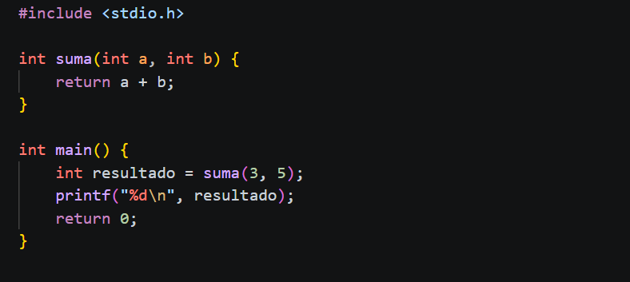
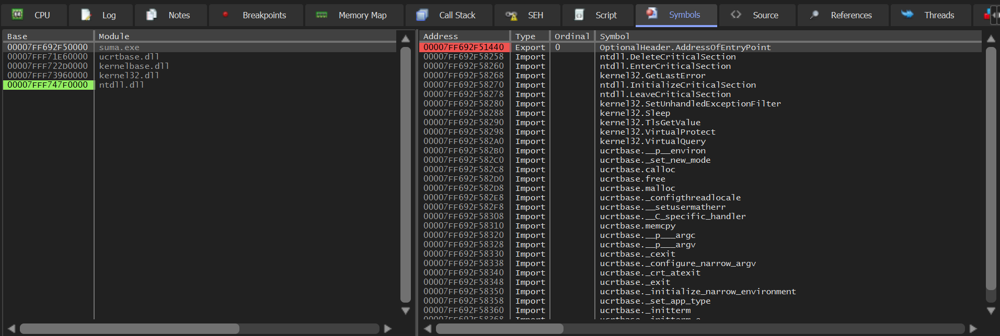
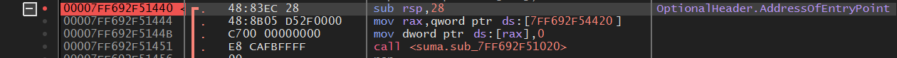
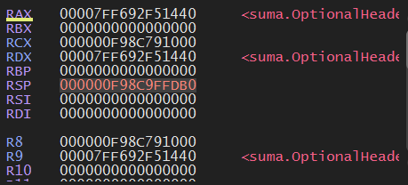
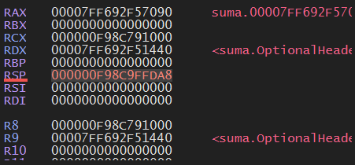
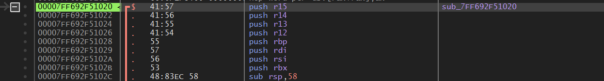
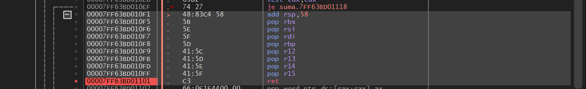

# Week 04 - The Stack 

### What I wanted to understand:
How the stack works, how the instruction PUSH and POP decrements and increments the RSP value and how the CALL instruction saves the memory adress to return using the RET instruction

### Tools used
- Windows 10 (dual boot)
- x64dbg (May 27 2026 build)
- gcc 15.2.0

### Process 
- I wrote a simple code in C to add two numbers.

- I compiled it using gcc `gcc -O0 suma.c -o suma.exe`.
- Next, I opened the .exe file with x64dbg and started searching for the stack.
- I used the `Symbols` option, searching for a symbol that let me reach the main function. I found the `OptionalHeader.AddressOfEntryPoint`.

- Once I found where the main function was allocated, I made a breakpoint at the `00007FF692F51440` address.

- I pressed `F9` to reach the breakpoint I made, and started running the program step by step using `F7`.
- At the start in `00007FF692F51440` the register `RSP` had a value of `000000F98C9FFDB0` in hex or `1071806152112` in dec. However, when I started to run the program and reach the CALL instruction at `00007FF692F51451`, the `RSP` value changed to `000000F98C9FFDA8` in hex or `1071806152104` in dec.
  

- Inside the function I observed the prologue: 8 consecutive PUSH instructions followed by `sub rsp, 58`. Each PUSH decremented RSP by 8 bytes, reserving space to save the original register values. The `sub rsp, 58` reserved additional space for local variables.

- At the end of the function the epilogue mirrored the prologue exactly: `add rsp, 58` followed by 8 POPs in reverse order, restoring RSP and all saved registers to their original values before `ret`.

### Where I got stuck 
When I tried to reach the main function, I didn't know where or how I should start the searching. I used google to understand x64dbg workflow and tools. I also got stuck when I tried to understand why the prologue ended up with a `sub rsp, 58`. 
### What I learned 
I learned how to use x64dbg in a more efficient way, and most important, how the Stack works. How the PUSH and POP instructions decrements and increments the RSP value, and how the CALL instructions acts as a 'checkpoint' to an specific address 

### Next step 
Week 05 - Conditional jumps and loops (CMP, JZ, JNZ). Return to the unresolved crackme from Week 03 that used these instructions.
